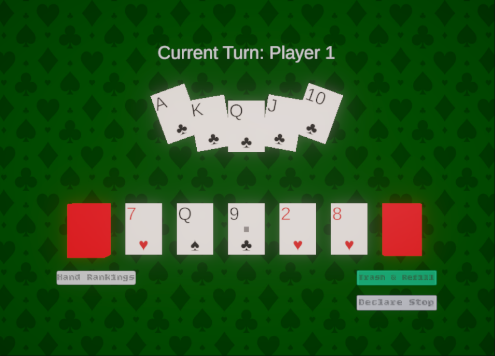

# BuilDeck (빌덱)

카드를 조합하여 나만의 덱을 만들고 전투에서 승리하세요! "있고 없고" 규칙을 기반으로 한 새로운 전략 카드 게임입니다.

## 🎮 게임 소개

BuilDeck은 "있고 없고"라는 간단한 규칙에 전략적인 깊이를 더한 카드 배틀 게임입니다. 플레이어는 매 턴 필드덱의 카드들 중 원하는 카드를 선택하여 자신의 덱을 구성하고, 강력한 덱을 만들어 상대방과의 전투에서 승리해야 합니다.

## ✨ 주요 기능

*   **전략적인 덱 빌딩:** 매 순간 최선의 카드를 선택하여 자신만의 전략적인 덱을 구축하세요.
*   **간단하지만 깊이 있는 규칙:** 배우기 쉬운 "있고 없고" 규칙이지만, 높은 수준의 전략적 사고를 요구합니다.
*   **다양한 카드:** 각각 고유한 능력을 가진 다양한 카드를 수집하고 활용하세요.
*   **랭킹 시스템:** 다른 플레이어와 경쟁하고 순위를 올려보세요.

## 📸 스크린샷

| 인게임 | 승리 화면 |
| :---: | :---: |
|  |  |

## 🚀 다운로드

**Google Play Store에서 BuilDeck을 만나보세요!**

*(현재 출시 대기중이며, 승인 완료 시 링크가 활성화됩니다.)*

`[Google Play Store Link - 준비 중]`

## 💻 사용된 기술

*   **게임 엔진:** Unity
*   **프로그래밍 언어:** C#

## 📄 라이선스

본 프로젝트는 [MIT 라이선스](LICENSE)를 따릅니다.